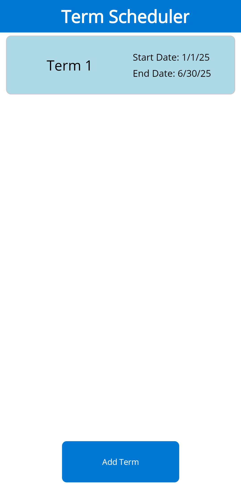
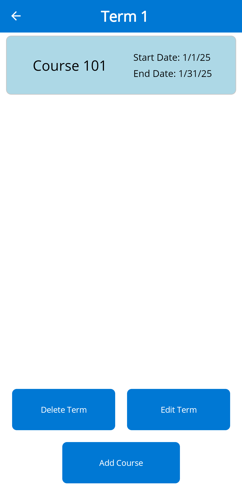
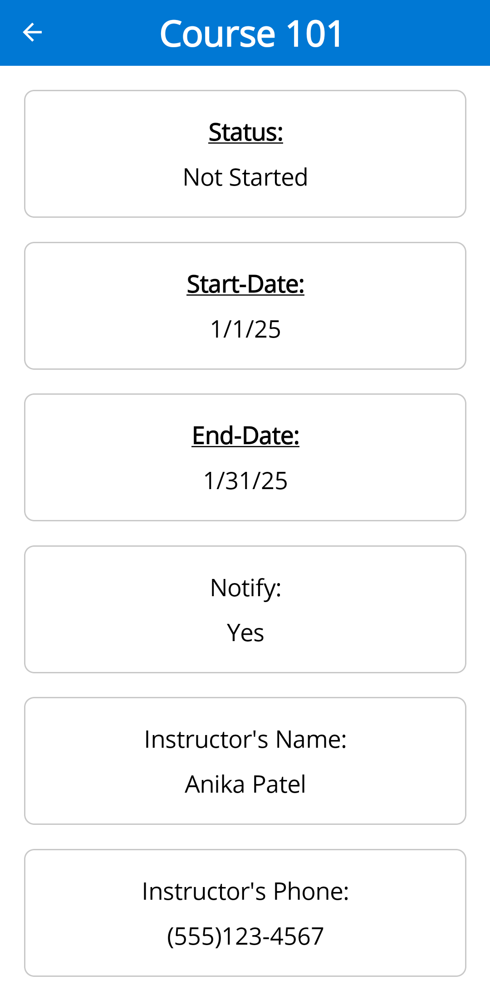
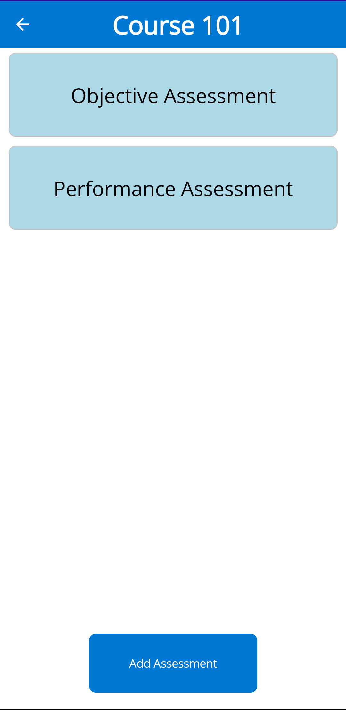
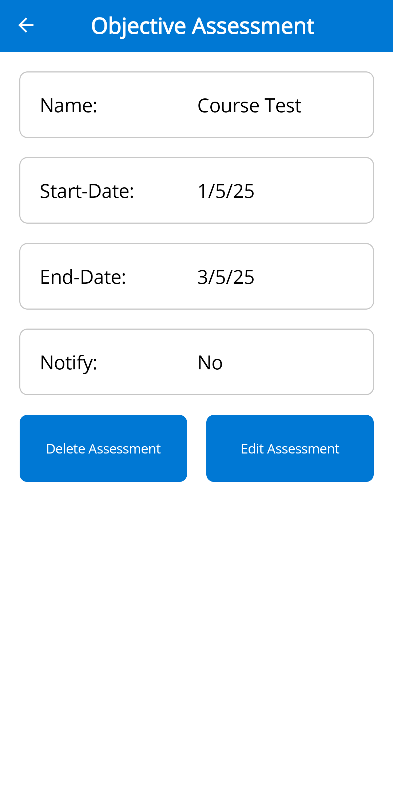

# 🗓️ School Term Scheduler

A simple and efficient mobile application to help students plan, organize, and track their academic terms, courses, and assessments.

---

## ✨ Features

- ✅ Manage Terms (add, edit, delete)
- ✅ Organize Courses within Terms
- ✅ Track Course Details
- ✅ Schedule and Manage Assessments
- ✅ Set Notifications for important dates
- ✅ Clean and minimalist design
- ✅ Built with .NET MAUI & MVVM Community Toolkit

---

## 📸 Screenshots

### 🏠 Home (Term Scheduler)

### 📚 Term View

### 📖 Course Details

### 🗂️ Assessment Overview

### 📝 Assessment Details

---

## 🛠 Tech Stack

- .NET MAUI (Multi-platform UI framework)
- MVVM Community Toolkit
- C#
- XAML

---

## ✅ Why This Project?

### This project demonstrates:
- A fully functional CRUD application
- Clean MVVM pattern using the MVVM Community Toolkit
- Cross-platform compatibility with .NET MAUI
- Data persistence for offline use
- Clean, user-friendly interface

---

## ⚡ Future Improvements
- Progress Tracking
- Cloud Sync & Authentication
- Improved Notification System
- Exporting Reports to PDF